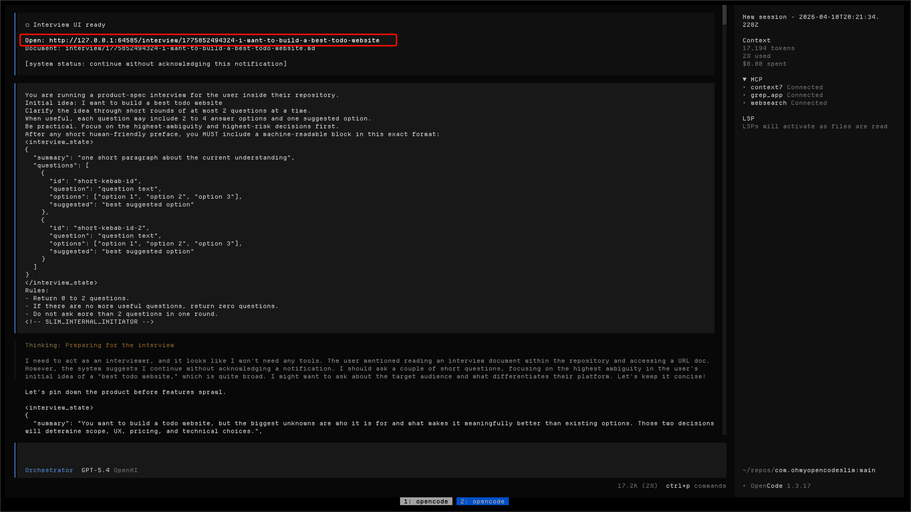
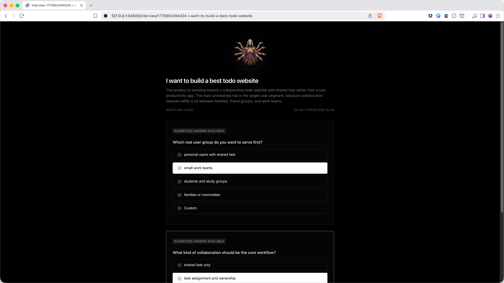

# Interview Feature Guide

`/interview` gives you a browser companion for the current OpenCode session.

Instead of answering everything inside the CLI/TUI, you can open a local page, click suggested answers, type custom ones when needed, and keep a live markdown spec growing inside your repo.

## What it does

`/interview` is designed for turning a rough idea into a clearer product spec through short Q&A rounds.

You start from OpenCode:

```text
/interview build a simple todo app for small teams
```

That opens a localhost interview UI connected to the **same OpenCode session**.

From there you can:

- answer the current questions in the browser
- use suggested/default answers to move faster
- use keyboard shortcuts for quick selection
- submit answers back into the same session
- keep a markdown document updated in `interview/*.md`

---

## Why use it

The browser flow is better when you want:

- a cleaner product-discovery loop than raw chat
- faster answering with click-to-select options
- a visible, growing markdown artifact in the repo
- less friction when iterating on feature requirements

It is especially useful for:

- feature planning
- product-spec interviews
- requirement clarification before implementation
- turning vague ideas into a working brief the agent can build from

---

## How it works

### 1. Start the interview

Run:

```text
/interview <your idea>
```

Example:

```text
/interview build a kanban app for design teams
```

OpenCode will post a local URL in the session.

---

### 2. Open the interview page

You will see a localhost link like this:



Open it in your browser.

---

### 3. Answer in the browser

The page keeps the focus on the current questions only.

- suggested answers are selected by default when present
- number keys can select options quickly
- `Custom` opens a text field for freeform input
- after picking the first answer, the UI moves you toward the next question

Current UI:



---

### 4. Submit answers back into OpenCode

When you submit, the browser sends those answers back into the **same session**.

The agent then:

- updates its understanding
- asks the next highest-value questions
- refreshes the markdown spec in your repo

---

## Output: live markdown file

The durable output is a markdown file written directly into:

```text
interview/
```

Example:

```text
interview/1775844895562-kanban-app-for-design-teams.md
```

The file looks like this:

```md
# Kanban App For Design Teams

## Current spec

A collaborative kanban tool for design teams with shared boards, lightweight comments, and web-first workflows.

## Q&A history

Q: Who is this for?
A: Design teams

Q: Is this web only or mobile too?
A: Web first

Q: Should boards be private or shared by default?
A: Shared by default
```

Notes:

- `Current spec` is refreshed as the interview evolves
- `Q&A history` is append-only
- answer options are **not** written into the markdown history

---

## Keyboard shortcuts

Inside the interview page:

- `1`, `2`, `3`, ... select the visible answer options for the active question
- the last number selects `Custom`
- `↑` / `↓` move between questions
- `Cmd+Enter` or `Ctrl+Enter` submits
- `Cmd+S` or `Ctrl+S` also submits

---

## Suggested answer flow

When the agent provides a suggested answer:

- it is selected by default to reduce friction
- you can accept it instantly
- or switch to another option
- or choose `Custom` and write your own answer

This keeps the flow fast without forcing you into the default.

---

## What makes it different from normal chat

Normal chat is flexible, but interviews are usually faster in a focused UI.

`/interview` gives you:

- one active question flow
- structured answer selection
- less noisy back-and-forth
- a repo-local markdown artifact from the start

It is not a replacement for chat — it is a better input mode for specification work.

---

## Current limitations

- localhost only by default
- browser page polls for updates instead of using real-time push
- runtime interview state is not meant to survive plugin restarts the way the markdown file does
- the feature depends on the assistant returning structured `<interview_state>` blocks

---

## Best use cases

Use `/interview` when you want to say things like:

- “Help me define this feature before building it.”
- “Turn this rough idea into a clearer spec.”
- “Ask me the right product questions one step at a time.”
- “Write the evolving spec into the repo while we refine it.”

---

## Related

- Main documentation index: [README.md](../README.md)
- Tools and built-ins: [docs/tools.md](tools.md)
- Configuration reference: [docs/configuration.md](configuration.md)
