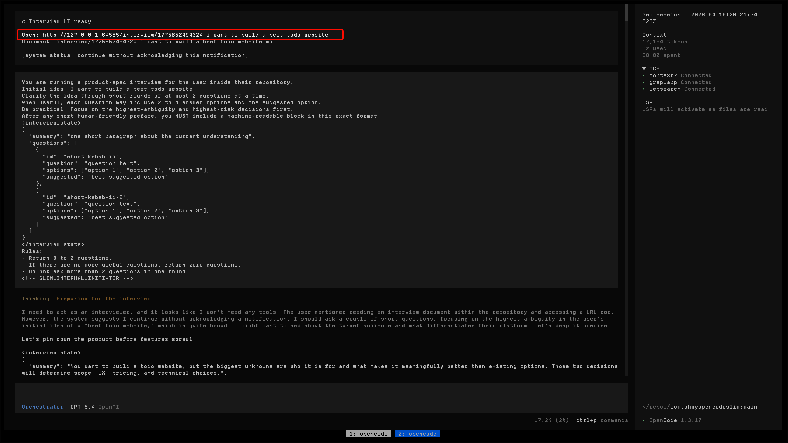
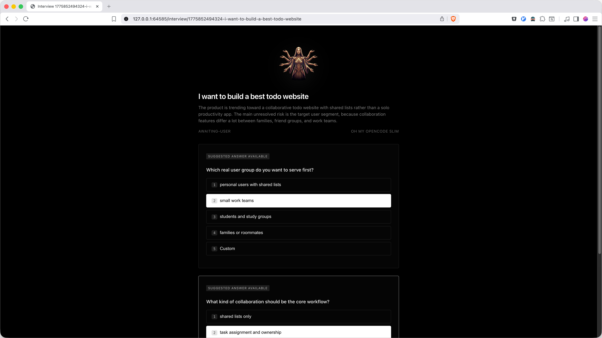

# Interview

`/interview` opens a local browser UI for refining a feature idea inside the same OpenCode session.

The command can be disabled globally with `"disabled_commands": ["interview"]` in
the Slim configuration; a disabled `/interview` is not registered.

Use it when chat feels too loose and you want a cleaner question/answer flow plus a markdown spec saved in your repo.

> Tip: `/interview` usually works well with a fast model. If the flow feels slower than it should, switch models in OpenCode with `Ctrl+X`, then `m`, and pick a faster one.

## Quick start

Start a new interview:

```text
/interview build a kanban app for design teams
```

What happens:

1. OpenCode starts the interview in your current session
2. a localhost page opens in your browser by default
3. the UI shows the current questions and suggested answers
4. answers are submitted back into the same session
5. a markdown spec is updated in your repo

OpenCode posts a localhost URL like this:



And the browser UI looks like this:



Resume an existing interview:

```text
/interview interview/kanban-design-tool.md
```

You can also resume by basename if it exists in the configured output folder:

```text
/interview kanban-design-tool
```

## What the TUI shows

By default the interview does not print the spec or the patch diff. The
orchestrator calls the `interview_submit_state` tool instead, and the TUI shows
just the tool row (`⚙ interview_submit_state`).

After each turn the service posts one status line:

```text
⎔ Spec updated · N questions · UI: <url> · Doc: <path>
```

If a turn ends without new state, it posts one error line instead:

```text
⎔ Interview update failed: <reason> · UI: <url>
```

Patch failures, including printed-state failures, return an error and receive at most
one repair prompt for a service-initiated turn. On a user-typed turn the error
is shown without starting a repair; the next service turn carries a brief note
to re-base on the current spec. The failed patch is not partially applied: the
last accepted spec remains on disk.

If the model prints an `<interview_state>` block instead of calling the tool, the
v1 text-block fallback is applied and hidden from the TUI. On OpenCode v2 the
fallback is applied by the bridge, but the printed fallback remains visible.

Providers that allowlist plugin tools must include `interview_submit_state` in
that allowlist, then be fully restarted; otherwise the model uses the text-block
fallback.

Set `interview.printState` to `true` to keep the full `<interview_state>` block
visible (legacy behavior). See [Options](#options).

## What the browser UI gives you

- focused question flow instead of open-ended chat
- suggested answers, clearly marked as recommended
- keyboard-driven selection for the active question
- custom freeform answers when needed
- visible path to the markdown interview file
- larger, more readable interview UI

## Markdown output

By default, interview files are written to:

```text
interview/
```

Example:

```text
interview/kanban-design-tool.md
```

The file contains three sections:

- `Frontmatter` - session meta data for recovery
- `Current spec` - 11-section structured specification doc (Introduction, Purpose, Requirements, Data Contracts, Acceptance Criteria, etc.)
- `Q&A history` - append-only question/answer record

Example:

```md
# Kanban App For Design Teams

## Current spec

# Introduction
...

## 1. Purpose & Scope
...

## Q&A history

Q: Who is this for?
A: Design teams

Q: Is this web only or mobile too?
A: Web first
```

### How filenames are chosen

New interview markdown files use a slugified idea followed by a unique ID.

Example:

- user input: `build a kanban app for design teams with lightweight reviews`
- file: `interview/kanban-design-tool-<uuid>.md`

The title in the specification does not choose the filename.

### Frontmatter

Interview files include YAML frontmatter for recovery after a crash or restart:

```yaml
---
sessionID: ses_abc123
baseMessageCount: 42
updatedAt: 2026-04-14T10:30:00.000Z
version: 1.0
date_created: 2026-04-14
owner: agent
tags: [spec, diagnostic]
consumedState: <sha256-hash>
status: complete
---
```

This allows the dashboard to rebuild state from disk without a live session.

## Keyboard shortcuts

Inside the interview page:

- `1`, `2`, `3`, ... select options for the active question
- the last number selects `Custom`
- `↑` / `↓` move the active question
- `Cmd+Enter` or `Ctrl+Enter` submits
- `Cmd+S` or `Ctrl+S` also submits

## Modes

The interview module has two modes: **per-session** (default) and **dashboard** (opt-in).

### Per-session mode (default)

When `port` is `0` (or unset) and `dashboard` is `false` (or unset), each OpenCode process runs its own interview server on a random port. This is the original behavior - no configuration needed.

```jsonc
{
  "oh-my-opencode-slim": {
    "interview": {}
    // or explicitly:
    // "interview": { "port": 0 }
  }
}
```

- one interview server per OpenCode process
- server starts lazily on first `/interview` command
- random port assigned by the OS
- all state is local to the session

### Dashboard mode

When `dashboard` is `true` or `port` is set to a value greater than `0`, interview switches to dashboard mode. A single dashboard server aggregates interviews from **all** OpenCode sessions on the same machine.

```jsonc
// Option A: dashboard on default port (43211)
"interview": { "dashboard": true }

// Option B: dashboard on custom port
"interview": { "dashboard": true, "port": 8888 }

// Option C: port > 0 implies dashboard mode
"interview": { "port": 43211 }
```

#### What the dashboard gives you

- **Single URL.** One dashboard page lists all active and past interviews across all sessions.
- **Multi-session coordination.** Each OpenCode process pushes interview state to the dashboard. The dashboard serves the web UI and relays answers back to the right session.
- **Failover recovery.** If the dashboard process dies, the next OpenCode process to start claims the port and rebuilds state from `.md` files on disk.
- **File browser.** Scans `interview/` (or your configured output folder) across all known project directories, including your home directory.

#### How it works

```
┌──────────────────────────────────────────────┐
│  Dashboard (dumb aggregator)                  │
│                                               │
│  • Receives state pushes from sessions        │
│  • Serves dashboard UI + interview pages      │
│  • Stores pending answers for session pickup  │
│  • Binds to 127.0.0.1, token-authenticated    │
└───────────▲───────────────────▲───────────────┘
            │ POST state        │ GET pending answers
┌───────────┴────────┐ ┌───────┴──────────────┐
│  Session Process A  │ │  Session Process B    │
│  (smart - drives    │ │  (smart - drives      │
│   LLM locally)      │ │   LLM locally)        │
└─────────────────────┘ └───────────────────────┘
```

Sessions are smart - they drive LLM interaction locally (parse state, inject prompts, write `.md` files). The dashboard is a dumb aggregator with a web UI. This means zero cross-process SDK dependency.

Browser submissions use a claim/ack delivery protocol. A session claims an
answer, chat message, block comment, or nudge before forwarding it to
OpenCode; successful forwarding acknowledges the claim, while a rejected
continuation rolls it back for a later retry. A failed poll therefore never
silently drops a queued action.

#### Auto-failover

Any OpenCode process can become the dashboard. The first process to bind the configured port wins. If it dies:

1. Other sessions detect the dead dashboard (failed state push or health probe)
2. The next process to start claims the port
3. The new dashboard rebuilds from `.md` files on disk using frontmatter

#### Session registration

Sessions register their project directory with the dashboard so it knows where to scan for interview files. This happens automatically on first `/interview` command or session event - no manual setup needed.

The dashboard also scans your home directory's output folder by default, so interviews created from a home-directory OpenCode session are always visible.

#### Dashboard settings

The dashboard page includes a settings panel for:

- **Scan days** - how far back to look for sessions (default: 30)
- **Add/remove folders** - manually add project directories to scan
- **Discover sessions** - re-scan the OpenCode session list for new directories

## Configuration

```jsonc
{
  "oh-my-opencode-slim": {
    "interview": {
      "maxQuestions": 2,
      "outputFolder": "interview",
      "autoOpenBrowser": true,
      "port": 0,
      "dashboard": false,
      "printState": false
    }
  }
}
```

### Options

- `maxQuestions` - max questions per round, `1-10`, default `2`
- `outputFolder` - where markdown files are written, default `interview`
- `autoOpenBrowser` - open the localhost UI in your default browser during interactive runs, default `true` (suppressed automatically in tests and CI)
- `port` - port for the interview server, `0-65535`, default `0` (OS-assigned in per-session mode). Set a fixed port to enable dashboard mode. Note: ports 1-1023 require elevated privileges on most systems.
- `dashboard` - enable dashboard mode on the default port (`43211`), default `false`. Setting `port` to a value greater than `0` also enables dashboard mode. If both are set, `port` takes precedence.
- `printState` - default `false`. When `true`, the interview model prints the full `<interview_state>` block in the TUI and the block is not stripped. When `false`, the quiet submit-tool path is used.

### Patch-based updates

The kickoff turn writes the full specification once. Later turns submit a
one-line `summary` status and a unified diff; the diff is applied to the
`Current spec` body on disk. Hunk line numbers are relative to that body, not to
the YAML frontmatter or Q&A history: old-side counts describe removed/context
lines, new-side counts describe resulting lines, and a zero-count old hunk
inserts at its one-based line hint. An empty patch preserves the body. The
frontmatter `consumedState` hash deduplicates a state observed more than once;
failed hunks always go to repair rather than being treated as already applied.

After kickoff, a state without `patch` is rejected as `Interview spec patch
required`. If a hunk does not apply, the interview enters the `patch did not
apply` error state. Service-initiated turns send one automatic repair prompt;
user-typed turns show the error and defer repair until the next service turn.
A second failed patch in one service turn does not trigger another repair.

Repeating `/interview` with the same idea resumes an existing non-placeholder
specification, including after the process restarts, and uses the patch-based
resume prompt instead of restarting the kickoff.

 The `interview_submit_state` tool is the quiet submission path. Its object
argument is omitted from the generic TUI row, which is followed by one
`Spec updated` or `Interview update failed` status line. It is allowed for
primary agents and denied for subagents. The v1 text-block fallback is hidden
from the TUI; v2 applies the fallback through its context bridge but leaves the
printed block visible. See [Tools](tools.md#interview_submit_state).

## Implementing a completed spec

Answers remain pending until a new accepted state incorporates them. While they
are pending, `/implement` refuses the active interview and its explicit path.
It also refuses while the latest spec update is in an error or pending-repair
state, even when the last accepted spec has no open questions.
`/implement` tells the agent to read the selected completed interview markdown
and implement its `Current spec` without reprinting it. With a live interview it
refuses while questions remain open. With no argument and no active interview it
falls back to the newest file whose frontmatter has `status: complete`; a path
or basename can be supplied explicitly, but an explicit path is accepted only
when its frontmatter has `status: complete`.

Reopening a completed interview clears its `status: complete` marker before the
new round begins. Complete marks `status: complete` under the document lock and
is idempotent, so concurrent confirmations produce one completion notice.

### Mode selection

| `port` | `dashboard` | Mode |
|--------|-------------|------|
| `0` (default) | `false` (default) | Per-session - each process runs its own server |
| `0` | `true` | Dashboard on default port 43211 |
| `> 0` | any | Dashboard on the specified port |

The v2 bridge receives the resolved values for all six interview options, so
`maxQuestions`, `outputFolder`, `autoOpenBrowser`, `port`, `dashboard`, and
`printState` is also honored when OpenCode loads the v2 plugin entry point.

## Remote access

The interview UI binds to `127.0.0.1`. To access it from a remote machine:

### Tailscale Serve

```text
tailscale serve --bg --https=443 http://127.0.0.1:<port>
```

### Cloudflare Tunnel

```text
cloudflared tunnel --url http://127.0.0.1:<port>
```

### SSH tunnel

```text
ssh -L <port>:127.0.0.1:<port> your-server
```

## Good use cases

- feature planning
- requirement clarification before implementation
- turning a rough idea into a spec the agent can build from
- keeping a lightweight product brief in the repo while iterating

## Current limitations

- localhost UI only
- per-session browser updates use polling; dashboard pages also receive SSE
  state pushes with polling fallback
- runtime interview state is in-memory; the markdown file is the durable artifact
- the flow depends on the assistant returning valid state, either through the
  `interview_submit_state` tool or the v1 text-block fallback
- dashboard mode answer delivery has a few seconds of latency (session polls the dashboard)

## Related

- [README.md](../README.md)
- [tools.md](tools.md)
- [configuration.md](configuration.md)

## OpenCode v2

On OpenCode v2, `/interview` uses an orchestrator-owned marker command and a
context bridge. Only the trailing marker message is rewritten, preserving the
provider cache prefix; streamed text events build the interview transcript in
memory. The bridge uses the v2 session methods for notifications, continuation,
and renaming without expanding the global client shim.

Every earlier full-spec kickoff in an active interview's history is collapsed to
a placeholder (`Previous spec omitted. The current spec is on disk.`); this
applies to both v1 text blocks and v2 tool-call parts. Later status/patch turns
are retained. This rewrite is gated to sessions with an active interview and
causes one deliberate cache miss per interview.

Selecting **Complete** marks the document `status: complete` under the document
lock. It is refused while answers await incorporation. The operation is
idempotent, and a repeated click does not post another completion notice.

In dashboard mode, session clients register at `/api/register` and unregister
at `/api/unregister` during cleanup. Browser submissions return HTTP `202` with
`{ "status": "queued" }`; the owning session processes them when idle.
