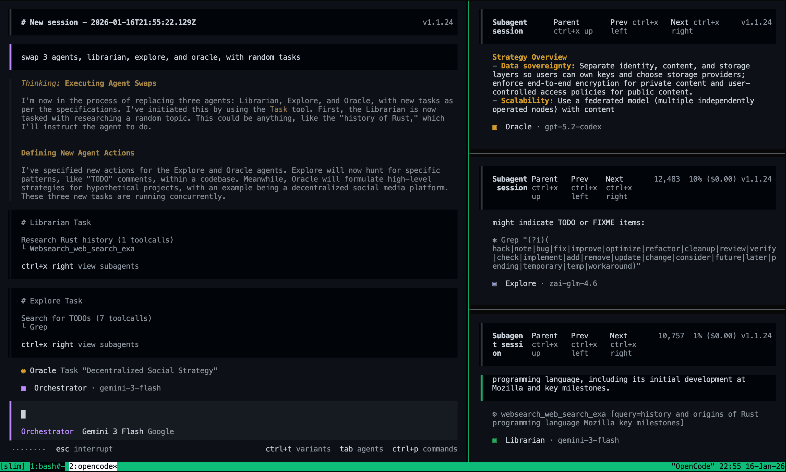

# Multiplexer Integration Guide

Use tmux, Zellij, Herdr, cmux-tui, or kitty to watch subagents work in live
views (split panes, or for cmux-tui sibling tabs) anchored to the TUI client
that displays their parent session.

> **Execution model:** panes are opened by the **TUI client** (`opencode attach`,
> or the TUI process of `opencode --port`), never by the OpenCode server. Each
> client manages only its own panes. See
> [Per-client view semantics](#per-client-view-semantics).

> **OpenCode v2 hosts:** pane creation is unavailable by design — the pane
> lifecycle is wired only in the v1 TUI entry. A configured `multiplexer.type`
> is ignored on v2 hosts (one diagnostic per process); v2's native subagent UX
> replaces panes. See [Deployment Modes](#deployment-modes) and
> [Known Limitations](#known-limitations).

## Table of Contents

- [Overview](#overview)
- [Deployment Modes](#deployment-modes)
- [Quick Start](#quick-start)
- [Configuration](#configuration)
- [Layouts](#layouts)
- [Per-client view semantics](#per-client-view-semantics)
- [Diagnostics and Logs](#diagnostics-and-logs)
- [Known Limitations](#known-limitations)
- [Behavior Changes and Removals](#behavior-changes-and-removals)
- [Troubleshooting](#troubleshooting)

---

## Overview

When OpenCode launches child agent sessions, oh-my-opencode-slim can open panes
for those sessions automatically.

- **Real-time visibility** into agent activity
- **Automatic pane management** while tasks run
- **Easy debugging** by jumping into live sessions
- **Support for multiple projects** on different sessions or ports



*OpenCode running in tmux with live subagent panes.*

How it works:

1. The **server** runs sessions and dispatches subagents. It never creates,
   closes, or positions a pane, and never reads multiplexer environment
   variables.
2. Every **TUI client** that displays the parent session subscribes to the
   host session events and, for each eligible child session, creates a view in
   **the pane it is itself running in** — a split pane (tmux / Zellij / Herdr /
   kitty), or a sibling tab appended to that pane (cmux-tui).
3. The pane runs a pure view command:

   ```text
   opencode attach <serverUrl> --session <childSessionId> --dir <directory>
   ```

   No prompt or instruction is ever passed to the pane; the plugin pane flow
   never creates a session and never sends a prompt. A pane is a view of a
   child that already exists.
4. When the child is deleted, or goes stable-idle, the client closes its pane.
   If the child turns busy again while its parent is still displayed, the pane
   is rebuilt at the then-current display position (never a remembered one).

Because dispatch happens only on the server, opening panes from several clients
does not multiply subagent dispatch: the number of dispatches always equals the
number of tasks the parent session started, regardless of how many panes exist.

Panes are opened only when the client can determine everything it needs. Any
uncertainty (admission mismatch, embedded host with no listener, missing
anchor, readiness timeout, adapter failure) is **fail-closed**: no pane is
created and a structured reason is logged.

## Deployment Modes

Pane behavior is fixed per host mode:

| Host start | Process shape | Server URL | Pane behavior |
|---|---|---|---|
| bare `opencode` | single process, TUI thread + embedded server, no TCP listener | sentinel, not attachable | **Not supported**: fail-closed + exactly one diagnostic |
| `opencode --port N` (or `--hostname` / `--mdns`) | single process, embedded server + listener | real | Supported (recommended single-machine path) |
| `opencode serve` + N × `opencode attach <url>` | multiple processes | real | Supported (target deployment) |
| `opencode run` | no TUI host | — | No pane (child runs in the host's native background mode) |
| `opencode --mini` | TUI host does not load plugins | — | No pane |
| v2 host | — | — | Feature off (v2 `setup()` is not wired); `multiplexer.type` is ignored, one diagnostic per process |

**Why embedded mode is not supported yet** (translated from the internal
requirements, §2.2):

> Bare `opencode` runs as a single process with two threads (TUI main thread +
> embedded server) and opens no TCP listener, so `opencode attach` in a child
> pane has no URL to connect to, and the plugin cannot create a listener on the
> host's behalf either. Pane creation therefore requires the server to be
> reachable over a URL — use `opencode --port <port>` or `opencode serve` +
> `opencode attach <url>`. When this mode is detected, the feature is turned off
> and exactly one diagnostic is recorded.

The diagnostic for this case is the `host-unreachable` reason (see
[Diagnostics and Logs](#diagnostics-and-logs)); it is emitted **exactly once per
process**. `opencode run` and `opencode --mini` never initialize the pane
wiring at all, so they produce no panes and no diagnostic noise.

## Quick Start

### 1. Enable the multiplexer

Edit `~/.config/opencode/oh-my-opencode-slim.json` (or `.jsonc`):

**Auto-detect (recommended):**

```jsonc
{
  "multiplexer": {
    "type": "auto",
    "layout": "main-vertical",
    "main_pane_size": 60
  }
}
```

**A specific adapter:**

```jsonc
{
  "multiplexer": {
    "type": "tmux"
  }
}
```

`type` is resolved **per client**: the client checks its own environment and
only enables panes when the configured adapter matches what it detects.

### 2. Start OpenCode with a reachable server

**Single machine (embedded TUI with a listener):**

```bash
tmux            # or zellij / herdr / kitty / cmux-tui
opencode --port 4096
```

Do not hard-code a fixed port when running several instances — pick a free one.

**Multiple clients / remote server (target deployment):**

```bash
opencode serve --port 4096
```

then, inside each multiplexer pane that should display the session:

```bash
opencode attach http://127.0.0.1:4096
```

### 3. Adapter-specific setup

**Tmux** — no setup. The client is detected via `TMUX_PANE` and addresses its
own tmux server with `-S <socket>` taken from `TMUX`.

**Zellij** — requires Zellij **0.44.1 or newer**. Detected via
`ZELLIJ_PANE_ID`; every command is addressed with `--session <name>` from
`ZELLIJ_SESSION_NAME`. Child panes always open in the tab containing the parent
pane — there is no dedicated agents tab and no tab switching.

**Herdr** — detected via `HERDR_PANE_ID`. Herdr's own OpenCode lifecycle
integration can be installed separately:

```bash
herdr integration install opencode
```

**cmux-tui** — the `cmux-tui` value of `multiplexer.type` selects the
cross-platform Rust TUI (`cmux.protocol/2`; `cmux-tui-v0.13.3+` is the
practical floor). Detected via `CMUX_TUI_SOCKET` (preferred) or legacy
`CMUX_MUX_SOCKET`; the anchor is resolved from `CMUX_TUI_TERMINAL_ID`.
Availability is a protocol read self-check, not `--version` — the binary
reports its crate version (`0.1.0`), which has nothing to do with the npm
distribution's version.

> **cmux-tui is not the macOS app.** `cmux` on macOS is a **different product
> that only shares the name**. It speaks the 0.64.x surface model
> (`CMUX_SOCKET_PATH`, `CMUX_SURFACE_ID`, `CMUX_PANEL_ID`,
> `CMUX_REMOTE_TRANSPORT`, `CMUX_BUNDLED_CLI_PATH`, …), none of which this
> adapter reads, and it ships **its own bundled CLI** — normally installed as
> `~/.cmux/bin/cmux`, where it shadows cmux-tui on `PATH` and where `cmux ssh`
> will overwrite it (deleting a cmux-tui binary that lived there). Neither the
> app nor its bundled CLI is supported. The plugin resolves the binary from
> `multiplexer.cmux_tui_binary` when set, then `which cmux-tui`, then
> `which cmux` (this last fallback is how the app's bundled CLI can be picked
> up; the probe logs `[cmux-tui] findBinary: found <path>`). Set the config
> key, or make sure the real cmux-tui comes first on `PATH`.

Child views are **sibling tabs appended inside the parent pane**, created
already named with the human-readable `parent_name/child_name` form
(`pane <parent pane> run --on-exit keep --name <parent_name/child_name> --
<attach argv>`). `parent_name` is the parent tab's `name`, or `Agent<plugin
pid>` when it is empty; `child_name` is `<subagent_type>:<up to 5 characters of
the child session id>` (`subagent` when the type is unavailable; for example
`Agent770446/oracle:GdEx6`). New tabs are
appended at the end (no reordering), and the pane's previously active tab is
restored after creation (falling back to the parent tab when it cannot be
determined). Closing uses `terminal close`, which removes every view of the
terminal **and ends its process** — unlike `tab close` / `pane close`, which
leave a zero-view process alive. cmux-tui has **no layout expression**:
`multiplexer.layout` and `multiplexer.main_pane_size` are ignored (no command
is issued).

**Kitty** — requires `allow_remote_control` **and** `listen_on` in
`kitty.conf`:

```conf
allow_remote_control yes
listen_on unix:/tmp/kitty-rc-$(USER)
```

`listen_on` makes kitty export `KITTY_LISTEN_ON` to its child processes
(including OpenCode); the plugin passes it through to every `kitten @`
invocation. After editing `kitty.conf`, **restart kitty** so the socket is
created, and verify with `kitten @ ls` from a normal shell.

### 4. Trigger delegated work

Ask OpenCode to do something that launches subagents. New panes appear next to
the pane that displays the parent session (for cmux-tui, a new tab appears
inside that pane).

## Configuration

```jsonc
{
  "multiplexer": {
    "type": "auto",
    "layout": "main-vertical",
    "main_pane_size": 60
  }
}
```

| Setting | Type | Default | Description |
|---------|------|---------|-------------|
| `type` | string | `"none"` | `"auto"`, `"tmux"`, `"zellij"`, `"herdr"`, `"cmux-tui"`, `"kitty"`, or `"none"` |
| `layout` | string | `"main-vertical"` | Layout preset: `main-vertical`, `main-horizontal`, `tiled`, `even-horizontal`, `even-vertical`. Each adapter maps it to its nearest native expression; cmux-tui has no layout expression and ignores it (see [Layouts](#layouts)) |
| `main_pane_size` | number | `60` | Main pane size percentage (`20`–`80`). Applied by tmux for the `main-*` layouts; ignored by Zellij, Herdr, kitty, and cmux-tui |
| `cmux_tui_binary` | string | omitted | Explicit path to the cmux-tui binary. When omitted, the client resolves `cmux-tui` first, then `cmux`, on `PATH` |

All `multiplexer.*` values are read by the client only. An invalid value
disables pane management (fail-closed) with a once-per-process diagnostic.

### Deprecated key: `zellij_pane_mode`

`multiplexer.zellij_pane_mode` is **no longer supported**. It is ignored, pane
management keeps working under the remaining configuration, and a one-time
deprecation warning is logged:

```text
[oh-my-opencode-slim] Deprecated multiplexer.zellij_pane_mode config key found and ignored.
Zellij panes always open in the tab containing the parent pane.
```

Remove the key from your config to silence the warning. There is no replacement
key: same-tab placement is the only Zellij behavior (see
[Behavior Changes and Removals](#behavior-changes-and-removals)).

### Legacy `tmux` config

The old top-level `tmux` block (`tmux.enabled` / `tmux.layout` /
`tmux.main_pane_size`) is deprecated and **ignored** (a warning is logged). It
is no longer converted automatically. Replace it with `multiplexer.*`:

```jsonc
// Before (ignored)
{ "tmux": { "enabled": true, "layout": "main-vertical" } }

// After
{ "multiplexer": { "type": "tmux", "layout": "main-vertical" } }
```

## Layouts

The five standard layouts and their fixed mapping per adapter. Where an adapter
has no exact equivalent, it uses the nearest native expression (marked
*approximate*); `main_pane_size` is tmux-only, and cmux-tui ignores both
settings entirely (its child views are tabs inside the parent pane, not panes in
a layout).

| Layout | tmux | Zellij | Herdr | kitty | cmux-tui |
|--------|------|--------|-------|-------|------|
| `main-vertical` | `-h` split, then `select-layout main-vertical` (+ `main-pane-width`) | `new-pane --direction right` | `pane split --direction right`; *approximate* agent column (below) | `tall` layout | ignored (no layout expression) |
| `main-horizontal` | `-v` split, then `select-layout main-horizontal` (+ `main-pane-height`) | `new-pane --direction down` | `pane split --direction down` | `fat` layout | ignored (no layout expression) |
| `even-horizontal` | `-h` split, then `select-layout even-horizontal` | no direction (Zellij's native placement) | `pane split --direction right` | `horizontal` layout | ignored (no layout expression) |
| `even-vertical` | `-v` split, then `select-layout even-vertical` | no direction (native placement) | `pane split --direction down` | `vertical` layout | ignored (no layout expression) |
| `tiled` | `-h` split, then `select-layout tiled` | no direction (native placement) | `pane split --direction right` | `grid` layout | ignored (no layout expression) |

Adapter notes:

- **tmux** — `select-layout` is applied only to anchor panes this client itself
  split into (panes it created are tracked per anchor), debounced by 150 ms so
  concurrent child starts do not thrash the window. `main-*` layouts also set
  `main-pane-width` / `main-pane-height` from `main_pane_size`.
- **Zellij** — direction is only a hint: when a tab is crowded (Zellij silently
  drops a directed split around ~4 stacked panes), the create is retried once
  without a direction and Zellij places the pane in the largest free space of
  the same tab. There is no layout rebalancing.
- **Herdr** — `main-vertical` is approximated: the first child opens in a
  right-side pane, and later children stack vertically inside that agent-area
  pane; if it is closed, the next spawn recreates it from the parent. There is
  no layout rebalancing.
- **kitty** — kitty has no per-window layout API. The mapped built-in layout
  (`tall` / `fat` / `grid` / `horizontal` / `vertical`) is applied to the tab
  containing the parent window via `goto-layout --match=window_id:<id>`, and
  the new window is placed next to the parent with `--next-to=id:<id>` (`id:`
  is the window search field; `window_id:` is tab-level and must not be used
  there). A layout that is already applied is not re-applied.
- **cmux-tui** — no layout expression: child views are tabs inside the parent
  pane, so `multiplexer.layout` and `multiplexer.main_pane_size` are ignored
  and no layout command is issued.

## Per-client view semantics

A pane is a **view**, and views belong to the viewer:

- Every TUI client that displays the parent session manages **its own** panes.
  Two clients displaying the same parent session and the same child each get
  their own pane, anchored to their own parent pane (next to it, or inside it
  as a tab for cmux-tui). This is expected, not a leak: anchors, control planes,
  and view handles are all client-local.
- There are **no cross-process files and no coordination** between clients. A
  client never writes where it is, and never touches another client's panes.
- A single client maintains **at most one pane per child session** (in-process
  state); duplicate/replayed events and reconnect compensation cannot create a
  second pane in the same client.
- Dispatch count is independent of pane count: multiple views of one child do
  not cause additional subagent dispatches.
- Switching the displayed session does not leak panes: status/idle/deleted
  events for children this client already holds keep being processed, so their
  panes still close under the normal rules. A rebuild, however, requires the
  parent to be the displayed session again at that moment.

If you do not want a pane on a particular client, disable panes for that
project there (`"type": "none"`), or simply close the pane; the child session
keeps running on the server.

## Diagnostics and Logs

The client initializes plugin logging and records every "no pane" outcome with
a structured, distinguishable reason:

| Reason | Meaning |
|--------|---------|
| `admission-none` | `multiplexer.type` is `"none"` |
| `admission-mismatch` | An explicit adapter is configured but the client is inside a different one |
| `admission-unavailable` | `auto` detected no supported multiplexer, or the config was invalid |
| `not-our-child` | The child's `parentID` is not the session this client currently displays |
| `host-unreachable` | Embedded host (no listener / sentinel URL) or the server probe failed |
| `readiness-timeout` | The child did not appear in `/session/status` within the bounded retry budget |
| `adapter-unavailable` | The adapter cannot run here (binary missing, old version, protocol self-check failed, no control plane) |
| `adapter-not-found` | The adapter could not resolve its anchor target; **no multiplexer command is issued** |
| `adapter-hard` | The multiplexer command failed for another reason |
| `backfill-skipped` | Reconnect compensation found this client already holds that child's pane |

Every successful creation logs the full identity: child session, parent
session, adapter, view handle (for cmux-tui the terminal id), and the anchored
target the view was created in. Admission and host diagnostics are emitted at
most once per cause per process. On v2 hosts a configured `multiplexer.type`
produces one `multiplexer.host-unsupported` record per process.

**Log paths:**

- Client (TUI): `$HOME/.local/share/opencode/log/oh-my-opencode-slim.tui-<stamp>.log`
  (honors `OPENCODE_LOG_DIR`; does not follow `XDG_DATA_HOME`)
- Server: `$HOME/.local/share/opencode/log/oh-my-opencode-slim.<stamp>.log`

## Known Limitations

- **Crash-leftover views are best-effort.** Views carry adapter-specific
  metadata encoding the owner pid and child session id. tmux / Zellij / Herdr /
  kitty write it into the pane title (`omosc:<owner pid>:<child session id>`);
  cmux-tui embeds a `# omosc:<owner pid>:<child session id>` data marker in the
  spawned process's argv instead (its tab name is the human-readable
  `parent_name/child_name` name). On startup/reconnect the client scans its own
  multiplexer for views whose owner process is dead **and** whose child session
  is gone, closing them. For the title-based adapters, once `opencode attach`
  starts inside the pane the host may rewrite the pane title (for example to
  `OC | <title>`), so the sweep often cannot recognize a crashed client's
  leftover pane — it is then left for you to close manually. For cmux-tui the
  sweep discovers candidates from `terminal list` and reads each terminal's
  argv with `terminal <sel> process show`, so user terminals are never touched.
  Exited terminals still appear in `terminal list` and still return their
  argv, so leftover tabs whose process already exited are cleaned up as well.
  Two classes are still left for you to close manually: views spawned under a
  `cmd.exe` shell, where the data marker cannot be written as a comment and is
  omitted (so the sweep cannot identify them), and legacy cmux-tui leftovers
  from the previous implementation. Cross-multiplexer leftovers are always
  manual.
- **cmux-tui child views occupy the parent pane's tab bar.** Each subagent gets
  a tab in the parent pane, appended at the end and never reordered; tabs are
  reclaimed when the child is deleted or closes on stable idle. This is the
  visible cost of the causally correct placement: a sibling tab cannot be
  misread as a child of another tab.
- **Closing a cmux-tui child tab can collapse the pane.** If the parent tab has
  already been closed and the child tab is the pane's last tab, closing the
  child removes the pane itself (cmux-tui's own lifecycle rule). This only
  happens after you have removed the parent view.
- **Closing the currently active view changes the active view.** The close path
  never touches the user's focus, with one unavoidable exception: when the view
  being closed is itself the active one, the active view necessarily changes
  (there is no close primitive that removes a view without that side effect).
  cmux-tui shows this whenever a child tab is the parent pane's active tab; this
  is accepted, not a defect.
- **Legacy cmux-tui leftovers need manual cleanup.** The previous cmux-tui
  implementation wrote `omosc:<pid>:<session>` into the pane name; the new
  sweep identifies cmux-tui views only by the argv data marker, so those legacy
  panes cannot be recognized and must be closed by hand.
- **Stable idle is a debounce, not task-level completion.** A pane closes when
  the child stays idle past the debounce window (default 5 s) and a final
  re-check finds it not busy: an absent `/session/status` entry counts as
  quiescent (opencode removes the entry when a turn ends), while `busy`/`retry`
  or an unreadable status keeps the pane. A child that goes briefly idle
  between model turns can therefore close and be rebuilt when it turns busy
  again (a visible flap). Session deletion always closes immediately.
- **Same-window layout interleaving is decorative.** tmux `select-layout`
  rebalances the whole window; two clients sharing one tmux window can
  interleave layout updates. Scope is limited to anchors this client created,
  but visual interleaving is possible and harmless.
- **Readiness requires the child to be live.** Before creating a pane the
  client polls `/session/status` with the project directory (sent as the
  pre-encoded `x-opencode-directory` header) with bounded retries. A child that
  was created but never ran never appears in the live status table and gets no
  pane (`readiness-timeout`). Real `task` dispatches make the child busy
  immediately, so this only affects synthetic sessions created through the REST
  API.
- **v2 hosts and embedded hosts have no pane feature** (see
  [Deployment Modes](#deployment-modes)); on v2 hosts a configured
  `multiplexer.type` is ignored and one diagnostic per process is logged.
- **Nested multiplexer detection priority is unchanged** (for example, kitty
  inside herdr), and a client only opens panes for children of the session it
  currently displays.
- **Pane scope is the project directory the TUI loaded with.** The pane
  lifecycle is scoped to the directory the TUI plugin started with
  (`api.state.path.directory` at load time). On a default install this never
  changes (`/sessions` is scoped to the current directory and `/move` moves
  the session, not the TUI). With the experimental workspaces feature
  (`OPENCODE_EXPERIMENTAL_WORKSPACES`) the directory can change at runtime
  (`/warp`, deleting the current workspace via `/workspaces`, or opening a
  session that belongs to another workspace), and pane management does not
  re-scope until the TUI is restarted. (Follow-up: re-scope the wiring and
  re-run admission when the route directory changes.)

## Behavior Changes and Removals

This release moves pane execution from the server to the TUI client. Every
removed or changed behavior, with migration guidance:

| # | Item | Old behavior | New behavior | Migration |
|---|------|--------------|--------------|-----------|
| 1 | `multiplexer.zellij_pane_mode` + agent-tab | Default `agent-tab` opened panes in a dedicated `opencode-agents` tab (with focus save/restore, first-pane reuse, `new-tab` / `go-to-tab-by-id`); `current-tab` opted into the parent tab | Key is unsupported and ignored; Zellij panes **always** open in the tab containing the parent pane (no tab creation, no tab switching, no focus save/restore) | Delete `zellij_pane_mode` from config. Leaving it is harmless: panes keep working and one deprecation warning is logged |
| 2 | tmux pane location registry | The TUI wrote `…/opencode/storage/oh-my-opencode-slim/tmux-panes/<hash>.json` (session → `TMUX_PANE`, owner pid, 30 s TTL); the server read it and otherwise fell back to the **server's own** `TMUX_PANE` | No cross-process files at runtime. Each client anchors on its own `TMUX_PANE`, re-resolved at spawn time, and addresses its own tmux server via `-S <socket>` from `TMUX` | None. Stale `tmux-panes/*.json` files can be deleted; nothing reads them |
| 3 | Deferred close for background jobs | On idle, the server checked the in-memory background job board; if a job was running the close was skipped and retried when the job finished (no debounce) | Client-side **stable-idle debounce** (default 5 s) plus a final idle re-check; busy within the window cancels the close; deletion closes immediately | None. If a child idles between turns, expect a close/rebuild flap (accepted; see [Known Limitations](#known-limitations)) |
| 4 | cmux-tui adapter | The macOS app — a different product that only shares the name (0.64.x, surface model): `CMUX_SOCKET_PATH` / workspace / surface ids, readiness polling, deferred spawn retries, orphan cooldowns, finite close budgets, hot-reload takeover, and vertical `equalize` rebalancing | Rewritten for **cmux-tui** (`cmux.protocol/2`): `CMUX_TUI_SOCKET` (or legacy `CMUX_MUX_SOCKET`), two-hop anchor (`CMUX_TUI_TERMINAL_ID` → terminal → tab → pane), a sibling tab appended inside the parent pane (`pane run --on-exit keep --name <parent/child> -- <argv>`), `terminal close`; availability by protocol read self-check, never `--version`; no cooldowns, budgets, deferred spawns, registries, `equalize`, or screen-level splits | Install **cmux-tui** (`cmux-tui-v0.13.3+`). The macOS app and the CLI it bundles are out of scope; macOS and Linux use the same cmux-tui binary and interface |
| 5 | Layout scope | Layouts/rebalancing could act broadly (server-side scope, kitty's global active-tab change, cmux-tui `equalize` affecting unrelated vertical subtrees) | Layout and close only ever touch panes this client created: tmux rebalances only anchors it split into, kitty applies its layout to the parent window's tab, cmux-tui performs no rebalancing at all | None. Layout behavior is now strictly per-client and per-created-pane |
| 6 | kitty active-window behavior | `kitten @ launch` opened windows relative to the active window, and the layout change hit the **active tab** | Anchoring is `KITTY_WINDOW_ID`: the new window is placed `--next-to=id:<parent>` and the mapped layout is applied to the **parent window's tab** (`--match=window_id:<id>`); the active tab is never modified | None. `main_pane_size` remains ignored by kitty |
| 7 | Embedded-mode restriction | Best-effort behavior with the server's environment; no listener required by design | Bare `opencode` (no TCP listener) is **fail-closed**: no pane and exactly one `host-unreachable` diagnostic; the plugin cannot create a listener for the host | Start with `opencode --port <port>`, or use `opencode serve` + `opencode attach <url>` |
| 8 | Per-client view semantics | One global manager decided pane placement, with a single view per child | Every client that displays the parent opens **its own** pane; the same child can have several panes, one per viewing client, with no coordination | Expect one pane per displaying client. Close extras manually if undesired; dispatch is still once per task |
| 9 | Server-side pane execution | `src/index.ts` built a multiplexer session manager and routed `session.created/status/idle/deleted` on the server; pane code read multiplexer env from the server process | Pane code lives only in the TUI entry's dependency graph. The server never creates, closes, or positions a pane and never reads multiplexer environment variables (invariant I1) | None. Headless and v2 hosts are unaffected (feature off) |
| 10 | cmux-tui child view placement | Subagent views were **screen-level split panes** shown side by side with the parent (and titled with the encoded `omosc:<pid>:<session>` name) | Each subagent view is a **sibling tab appended inside the parent pane**, created already named `parent_name/child_name`; the pane's previously active tab is restored after creation; closing uses `terminal close` (ends the process) | None. No config change; `multiplexer.layout` / `multiplexer.main_pane_size` are now ignored for cmux-tui |
| 11 | `multiplexer.type: "cmux"` value | The type value `"cmux"` selected the cmux-tui adapter | The value is renamed to `"cmux-tui"`; `"cmux"` is no longer a valid type, so the key is dropped, the type falls back to `"none"` (pane management disabled), and a once-per-process diagnostic reports the rename | Rename the value to `"cmux-tui"` |

## Troubleshooting

**No panes at all**

1. Check the client log
   (`$HOME/.local/share/opencode/log/oh-my-opencode-slim.tui-*.log`) for the
   `no pane` reason.
2. `admission-none` → set `multiplexer.type` to `auto` or the right adapter.
3. `admission-mismatch` → the configured adapter is not the one the client is
   inside (for example `type: "zellij"` while running in tmux).
4. `host-unreachable` → the host has no reachable listener; restart with
   `--port` or use `serve` + `attach`.
5. `readiness-timeout` → the child never became visible in `/session/status`
   (see [Known Limitations](#known-limitations)).

**Panes open in the wrong place**

- The view is always created in the pane that displays the parent session at
  spawn time: a split for tmux / Zellij / Herdr / kitty, or a tab inside that
  pane for cmux-tui. Move the parent session to another pane/multiplexer first;
  a rebuild after the child turns busy follows the new position.
- Missing anchor (`adapter-not-found`) means no multiplexer command was issued
  at all — the client could not resolve its own anchor from the environment.

**Zellij**

- Older than 0.44.1 → the adapter reports unavailable and is skipped.
- In a crowded tab, the directed split is retried without a direction; the pane
  still lands in the same tab.

**Kitty**

- `KITTY_LISTEN_ON` missing → add `listen_on` to `kitty.conf` and restart
  kitty; verify with `kitten @ ls`.

**cmux-tui**

- `adapter-unavailable` → the resolved binary is not cmux-tui. The usual cause
  is the macOS app's bundled CLI shadowing it on `PATH` (the app installs
  itself as `~/.cmux/bin/cmux`, and `cmux ssh` rewrites that path). Check the
  path reported by the `findBinary: found` line in the client log to see which
  binary was picked; the log redactor masks opaque runs of 33+ characters
  (4 leading + 2 trailing survive), so a deeply nested path prints as
  `/tmp/…ux` while typical install paths print in full. Then set
  `multiplexer.cmux_tui_binary` to the real cmux-tui binary or put it first on
  `PATH` — the explicit key is tried before any `PATH` probe.

**Panes close and reopen**

- The child idled past the debounce window and then turned busy again. This is
  the accepted stable-idle semantics; see
  [Known Limitations](#known-limitations).

**Leftover views after a client crash**

- The sweep is best-effort. For tmux / Zellij / Herdr / kitty it often cannot
  match a pane whose title was rewritten by `opencode attach`. For cmux-tui it
  identifies views by the `# omosc:...` argv marker; exited terminals keep that
  argv and `terminal close` still works on them, so a crashed client's leftover
  tabs are recognized whether or not their process is still running. Only
  legacy cmux-tui leftovers created by the previous implementation (which wrote
  `omosc:` into the pane name) are not recognized. Close such views manually.
