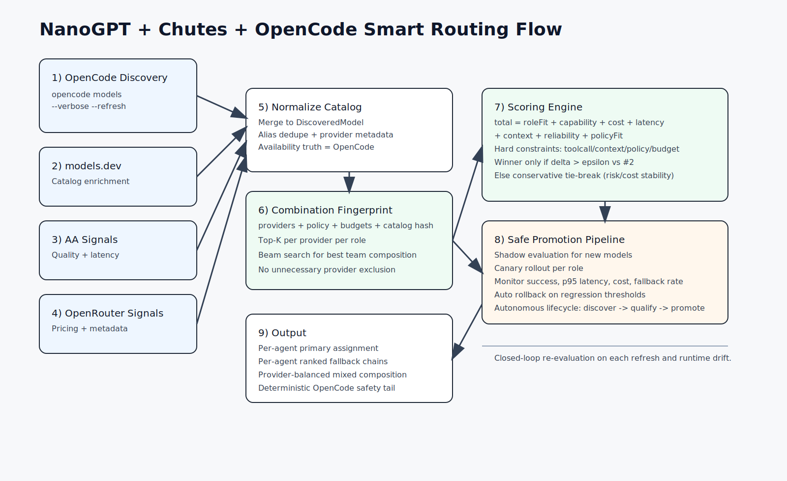

# NanoGPT Smart Routing Plan



## Goal

Design NanoGPT integration so it behaves like Chutes in the installer flow,
but with smarter N-way model assignment instead of fixed
`primary + secondary` selection.

This plan is intentionally aligned to the current architecture in:

- `src/cli/install.ts`
- `src/cli/types.ts`
- `src/cli/providers.ts`
- `src/cli/dynamic-model-selection.ts`
- `src/cli/chutes-selection.ts`

## Product Intent

### What we want

- Add NanoGPT as a first-class provider toggle (`--nanogpt=yes|no`).
- Select from many NanoGPT models dynamically per agent role.
- Use subscription-aware routing first, then intelligent fallback.
- Keep compatibility with existing mixed-provider strategy (OpenAI,
  Anthropic, Kimi, Antigravity, Chutes, OpenCode free, Copilot, ZAI Plan).

### What we explicitly avoid

- Hardcoding NanoGPT to only two chosen models.
- Adding a separate static preset that bypasses dynamic planning.
- Making NanoGPT routing opaque (must be explainable and testable).

## Billing Assumptions

- Subscription baseline is treated as `$8` (product decision from user).
- NanoGPT has separate routing surfaces for:
  - subscription-covered calls
  - pay-as-you-go calls

The planner must choose billing mode intentionally per role and per fallback.

## Current State (Relevant Constraints)

## 1) Chutes is modeled as 2 slots

- `InstallConfig` currently stores:
  - `selectedChutesPrimaryModel`
  - `selectedChutesSecondaryModel`
- Assignment pattern is fixed:
  - `orchestrator`, `oracle`, `designer` -> primary
  - `explorer`, `librarian`, `fixer` -> secondary

This appears in both config generation and dynamic resolution layers.

## 2) Dynamic planner is already multi-provider and role-aware

`buildDynamicModelPlan` in `src/cli/dynamic-model-selection.ts` already has:

- role-specific scoring
- provider diversity balancing
- provider-aware fallback chain assembly
- precedence resolution with provenance

So we should extend this engine, not build a second planner.

## 3) Provider integration points exist

- Provider enablement is centralized (`getEnabledProviders`).
- Fallback chain composition is centralized.
- Tests already validate matrix scenarios and dynamic outcomes.

This is a good base for NanoGPT N-way routing.

## Target Architecture

## A) New NanoGPT provider surface

Add NanoGPT in all provider control points:

- CLI flag parsing in `src/cli/index.ts`
- install toggles and prompts in `src/cli/install.ts`
- install types in `src/cli/types.ts`
- config detection and merge behavior in `src/cli/config-io.ts`
- provider mapping + fallback wiring in `src/cli/providers.ts`
- dynamic provider enablement in `src/cli/dynamic-model-selection.ts`

## B) Replace NanoGPT 2-slot idea with per-agent mapping

Introduce explicit per-agent selected models for NanoGPT:

```ts
type AgentName =
  | 'orchestrator'
  | 'oracle'
  | 'designer'
  | 'explorer'
  | 'librarian'
  | 'fixer';

type BillingMode = 'subscription' | 'paygo';

interface SelectedNanoGptAgentModel {
  model: string;
  billingMode: BillingMode;
}

type SelectedNanoGptModels = Record<AgentName, SelectedNanoGptAgentModel>;
```

Store in `InstallConfig`:

- `hasNanoGpt?: boolean`
- `selectedNanoGptModels?: SelectedNanoGptModels`
- `availableNanoGptModels?: DiscoveredModel[]`
- `nanoGptRoutingPolicy?: 'subscription-only' | 'hybrid' | 'paygo-only'`

## C) Add NanoGPT model selector module

Create `src/cli/nanogpt-selection.ts` with:

- model pool filtering by policy
- role scoring weights
- billing penalty/bonus logic
- chain builder for top-N per role

Core API:

```ts
function pickNanoGptModelsForAgents(input: {
  models: DiscoveredModel[];
  policy: 'subscription-only' | 'hybrid' | 'paygo-only';
  subscriptionState?: {
    active: boolean;
    dailyRemaining?: number;
    monthlyRemaining?: number;
  };
}): {
  assignments: Record<AgentName, { model: string; billingMode: BillingMode }>;
  chains: Record<AgentName, Array<{ model: string; billingMode: BillingMode }>>;
}
```

## D) Integrate into dynamic planner

Extend `buildDynamicModelPlan` so NanoGPT candidates participate like other
providers, but with two extra dimensions:

- billing mode (subscription vs paygo)
- subscription budget pressure

Do not fork planner logic. Keep one planner with provider-specific features.

## Scoring Strategy

## Role profiles (same six agents)

- `oracle`, `orchestrator`: quality/reasoning/context first
- `designer`: quality + multimodal/tool capability
- `fixer`: code + toolcall + speed balance
- `librarian`: context + toolcall + reliability
- `explorer`: latency + toolcall + low cost

## Score components

For each `(agent, model, billingMode)` candidate:

`total = roleFit + capabilityFit + priceFit + latencyFit + contextFit + reliabilityFit + billingPolicyFit + diversityAdjustment`

### Required terms

- `roleFit`: existing role intent from dynamic planner
- `priceFit`: normalized from input/output pricing where available
- `latencyFit`: from external signals when available
- `billingPolicyFit`:
  - strong penalty when policy forbids the mode
  - subscription bonus when quota healthy
  - subscription penalty as quota approaches threshold
- `diversityAdjustment`: avoid over-concentration on one provider/model family

## Budget-aware behavior

### Policy: `subscription-only`

- Only subscription-eligible NanoGPT candidates are allowed.
- On quota exhaustion, fail over to non-NanoGPT providers in chain.

### Policy: `hybrid`

- Prefer subscription for costly/high-volume roles (`librarian`, `explorer`).
- Use paygo when:
  - quality jump is material and justified (`oracle`, `orchestrator`), or
  - subscription quota is low.

### Policy: `paygo-only`

- Treat NanoGPT like regular metered provider.
- Ignore subscription preference weights.

## Provider Interop (Chutes, OpenCode Free, and others)

NanoGPT should not replace existing providers; it should join the same
selection universe.

Important implementation commitment: Chutes and OpenCode free will be brought
into the same per-agent dynamic selection style as NanoGPT, so we avoid mixed
architectures (some providers N-way, others fixed two-slot).

## Existing providers that must stay first-class

- OpenAI (`openai/*`)
- Anthropic (`anthropic/*`)
- Kimi (`kimi-for-coding/*`)
- Antigravity/Google (`google/*`)
- Chutes (`chutes/*`)
- Copilot (`github-copilot/*`)
- ZAI Plan (`zai-coding-plan/*`)
- OpenCode free (`opencode/*`)

## Interop rules

- NanoGPT, Chutes, and OpenCode free all use per-agent model maps and dynamic
  ranked chains (no global `primary/secondary` split).
- Selection is provider-parallel, not provider-exclusive: we score the best
  candidate(s) per provider per role first, then compose mixed-role outcomes.
  Providers do not need to exclude each other by default.
- Keep Chutes priors (for known strong models) but make them compete fairly
  with NanoGPT in role ranking.
- Keep OpenCode free in the same ranking pool, but reserve deterministic tail
  fallback only as the final safety layer.
- Preserve provider balancing behavior when `balanceProviderUsage` is enabled.

## Unified Migration Commitment

This plan will implement one unified selector behavior for three providers:

- NanoGPT
- Chutes
- OpenCode free

For all three providers, we will support:

- per-agent selected model mapping
- per-agent ranked fallback chains
- policy-aware filtering before scoring
- per-provider best-candidate selection before final global composition

Chutes-specific and OpenCode-specific heuristics remain, but within the same
N-way assignment framework.

## Dynamic Selection Principle (No Unnecessary Exclusion)

The planner should not force all roles onto one provider and should not enforce
hard mutual exclusion between providers unless explicitly configured.

Default behavior:

- Step 1: rank models inside each provider per role.
- Step 2: keep top-K per provider per role (provider representatives).
- Step 3: compose final role assignments from the union of provider
  representatives using total score and soft diversity constraints.
- Step 4: build per-role chains from remaining high-score candidates.

This captures real model differences across providers and avoids collapsing to a
single-provider outcome when multiple providers have role-specific strengths.

## Combination-aware Agent Composition (Super Smart Mode)

Each active provider combination must produce its own best composition across
all six agents. The planner should not reuse one static distribution.

Strategy:

- Build a `combination fingerprint` from active providers, policy, and current
  model catalogs.
- For that fingerprint, solve assignment globally across all agents with a
  constrained optimizer:
  - maximize total utility across all roles
  - add soft penalties for over-concentration on one provider/model family
  - keep hard constraints for required capabilities (toolcall, context limits,
    policy filters)
- Evaluate candidate plans using beam search (`top M` partial plans per step)
  instead of greedy single picks, then choose best final plan.
- Cache the winning plan per fingerprint and recompute when catalog/policy/
  budget changes.

Outcome:

- Different provider combinations naturally yield different full-team
  compositions.
- Every agent gets role-optimized assignment relative to the exact provider set
  enabled at that moment.

## Autonomous Winner Selection (No Manual Per-Model Review)

Goal: you should not need to manually inspect each newly discovered model.

Planner behavior for every new model in catalog refresh:

- Auto-ingest model into normalized catalog (`DiscoveredModel`).
- Auto-score model per role with provider-aware and policy-aware terms.
- Auto-place model in fallback chains where it beats current candidates.
- Auto-promote to primary assignment only after gated validation.

Promotion gates (must all pass):

- Hard constraints pass: policy, toolcall, context, budget limits.
- Expected score gain above threshold vs current winner (`delta >= epsilon`).
- Reliability gate: timeout/error rate below configured max.
- Cost gate: projected cost increase remains within policy budget envelope.

If a candidate fails a gate, it remains fallback-only and is re-evaluated on
future refreshes.

## Runtime Guardrails and Auto-Rollback

To keep this autonomous and safe, runtime includes:

- Shadow evaluation for newly promoted candidates before full adoption.
- Canary rollout ratio per role (small percentage first).
- Continuous metrics by `(provider, model, role, billingMode)`:
  - success rate
  - p50/p95 latency
  - cost per successful task
  - fallback trigger rate
- Automatic rollback to previous winner when thresholds regress.

This makes winner selection self-correcting without manual triage.

## Policy for New Models (Default Lifecycle)

1. Discovery: model appears via `opencode models --verbose --refresh` and/or
   `models.dev`.
2. Qualification: model is scored and inserted in ranked chains.
3. Trial: model can run in shadow/canary for relevant roles.
4. Promotion: model becomes primary if winner criteria hold.
5. Retirement: model is downranked/removed automatically on sustained
   regressions or deprecation.

## Discovery Inputs (Catalog Refresh)

Model discovery should use both provider-native and aggregate sources so routing
stays current.

Primary sources:

- `opencode models --verbose --refresh`
- `models.dev` catalog signal ingestion (where available)

Runtime behavior:

- Normalize all discovered models into `DiscoveredModel`.
- Merge duplicates by canonical model key aliases.
- Keep provider-specific metadata when available (pricing, limits,
  capabilities, status).

## Data Source Stack (What powers winner selection)

The autonomous selector uses all relevant sources, with clear priority:

1. OpenCode discovery (`opencode models --verbose --refresh`)
   - Role: source of truth for currently available/usable models.
2. models.dev
   - Role: catalog enrichment and broader model metadata signals.
3. Artificial Analysis (AA)
   - Role: quality and latency signal enrichment for ranking.
4. OpenRouter signals
   - Role: pricing and external model metadata enrichment.

Source precedence for decisioning:

- Availability truth: OpenCode discovery wins.
- Performance/quality enrichment: AA preferred when present.
- Pricing enrichment: OpenRouter preferred when present.
- Missing-source fallback: planner continues with remaining sources and
  internal heuristics (no manual intervention required).

## Implementation Plan (File-by-File)

## 1) Types and flags

Update `src/cli/types.ts`:

- Add `nanogpt?: BooleanArg` to `InstallArgs`.
- Add NanoGPT fields to `InstallConfig` and `DetectedConfig`.
- Add typed structures for selected NanoGPT assignments and routing policy.

Update `src/cli/index.ts`:

- Parse `--nanogpt=yes|no`.
- Include NanoGPT in help text examples.

## 2) Installer workflow

Update `src/cli/install.ts`:

- Add NanoGPT provider toggle in both TUI and non-TUI paths.
- Add model discovery for NanoGPT catalog.
- Add policy question: `subscription-only`, `hybrid`, `paygo-only`.
- In auto mode, call `pickNanoGptModelsForAgents` to prefill per-agent mapping.
- Persist selections in `InstallConfig` and summary output.

## 3) Config read/write + detection

Update `src/cli/config-io.ts`:

- Detect NanoGPT usage from provider and model IDs.
- Preserve NanoGPT structured fields on merge.

## 4) Provider mappings

Update `src/cli/providers.ts`:

- Add `nanogpt` in `MODEL_MAPPINGS` for baseline defaults.
- Add NanoGPT-aware fallback insertion helpers parallel to Chutes/OpenCode.
- For dynamic preset path, consume `dynamicModelPlan` as-is (already role-level).

## 5) Dynamic planner core

Update `src/cli/dynamic-model-selection.ts`:

- Include NanoGPT in enabled providers.
- Add selected NanoGPT per-agent resolver helper.
- Incorporate NanoGPT policy and billing mode into score and chain generation.
- Keep precedence/provenance layers intact.

## 6) New selector module

Add `src/cli/nanogpt-selection.ts`:

- agent-scoped scoring
- policy filtering
- N-way assignment builder
- fallback chain recommendations

Add tests in `src/cli/nanogpt-selection.test.ts`.

## 6b) Align Chutes and OpenCode free to same model

Update existing Chutes/OpenCode selection flows so they also emit per-agent
maps and N-way chains:

- Refactor `src/cli/chutes-selection.ts` from two-slot outputs to per-agent
  scored outputs.
- Add `src/cli/opencode-free-selection.ts` (or extend existing OpenCode
  selection logic) to produce per-agent outputs using current free-model
  constraints.
- Add provider-local representative selection helpers so each provider can
  contribute its best role-specific models before final cross-provider compose.
- Replace `selectedChutesPrimaryModel` / `selectedChutesSecondaryModel` and
  `selectedOpenCodePrimaryModel` / `selectedOpenCodeSecondaryModel` as runtime
  control points with role-level selected maps.

## 7) Tests to update/add

- `src/cli/providers.test.ts`
- `src/cli/dynamic-model-selection.test.ts`
- `src/cli/dynamic-model-selection-matrix.test.ts`
- Add combinational matrix validation:
  - 2-provider up to N-provider combinations produce distinct team layouts when
    model landscape differs
  - ensure plan quality does not regress vs greedy baseline
- new NanoGPT-specific matrix cases:
  - NanoGPT-only
  - NanoGPT + Chutes
  - NanoGPT + OpenAI + OpenCode
  - NanoGPT hybrid low-quota simulation

## Acceptance Criteria

- NanoGPT can be enabled from installer like existing providers.
- NanoGPT assignments are per-agent, not global primary/secondary.
- Chutes and OpenCode free are also configured via per-agent assignments,
  not global primary/secondary.
- Planner composes from best-per-provider role candidates dynamically, without
  unnecessary provider exclusion.
- Planner generates combination-specific team composition across all agents
  (not one static mapping reused for different provider sets).
- Dynamic planner can mix NanoGPT with Chutes and all other providers.
- Fallback chains contain more than two NanoGPT candidates where applicable.
- Fallback chains contain role-ranked entries for Chutes and OpenCode free as
  well, with OpenCode free deterministic tail preserved.
- `balanceProviderUsage` still works with NanoGPT enabled.
- Tests pass for static presets and dynamic planning matrix.

## Example Desired Outcome

Given active providers: NanoGPT + Chutes + OpenAI + OpenCode free

- `oracle`: `nanogpt/<high-reasoning-model>` (subscription)
- `orchestrator`: `openai/gpt-5.3-codex`
- `designer`: `chutes/kimi-k2.5`
- `fixer`: `nanogpt/<fast-code-model>` (paygo)
- `librarian`: `nanogpt/<large-context-model>` (subscription)
- `explorer`: `chutes/minimax-m2.1`

Each role gets a distinct top-ranked chain with deterministic OpenCode tail.

## Risks and Mitigations

- Risk: metadata mismatch across providers.
  - Mitigation: normalize in model discovery into `DiscoveredModel`.
- Risk: unstable costs when paygo is overused.
  - Mitigation: policy gates + billing penalties + budget thresholds.
- Risk: score drift vs existing tuned behavior.
  - Mitigation: keep V1/V2 comparison path and add NanoGPT shadow tests.

## Rollout Strategy

1. Ship behind a config flag (`hasNanoGpt` + policy default `hybrid`).
2. Add shadow scoring telemetry in tests first (no behavior break).
3. Enable full dynamic selection once matrix tests are stable.

## Notes for Follow-up PR

- Keep change scope additive but include Chutes/OpenCode selector alignment in
  the same roadmap.
- Reuse planner hooks where possible; avoid isolated per-provider planners.
